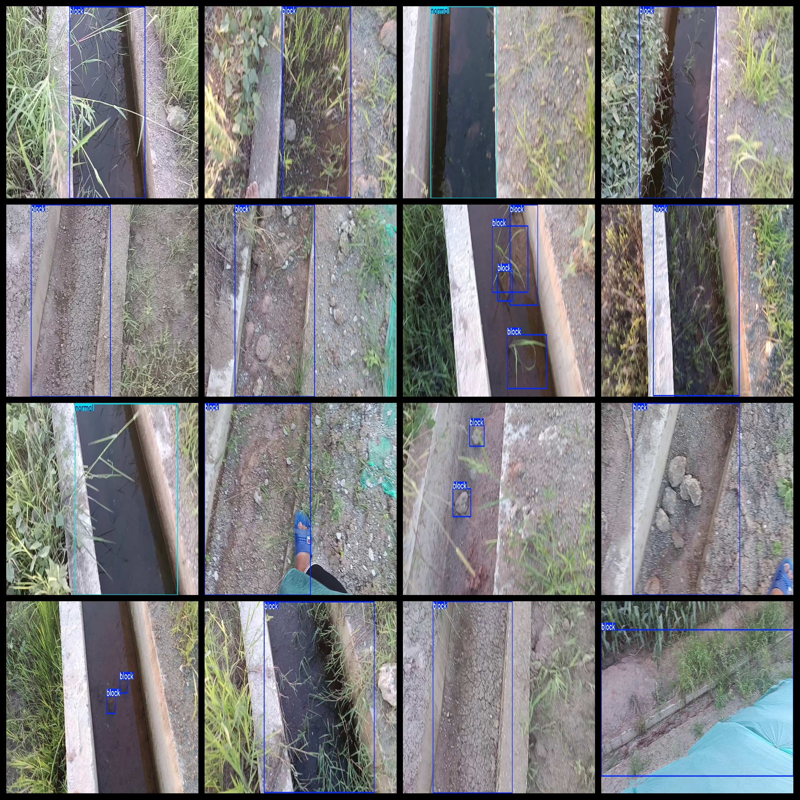

# Slope Drainage Ditch Blockage Dataset is a dataset containing 1488 images in the format of VOC+YOLO.

The dataset format is Pascal VOC format plus YOLO format (excluding the split path's txt file, only containing jpg images as well as their corresponding VOC format xml files and YOLO format txt files).

Number of images (jpg file count): 1488

Number of annotations (xml file count): 1488

Number of annotations (txt file count): 1488

Number of annotation categories: 2

Github repository: firc-dataset

Annotation category names in labels folder (notice that the order of YOLO format categories does not correspond to this one, but rather to the "classes.txt" file in the labels folder): ["block", "normal"]

Boxes per category:

Block (blockage/sedimentation) boxes = 1328

Normal (normal) boxes = 295

Total boxes = 1623

Number of images per category:

Block occupies 1193 images

Normal occupies 295 images

Image resolution: 1920x1080

Labeling tool used: labelImg

Labeling rules: draw a box around the category

Important note: The dataset does not have separate training, validation, or test sets; you need to divide them yourself.

Special declaration: This dataset does not guarantee any accuracy for models trained on it or weight files.

Annotation and image details are as follows:

## Images

---

Here is a pay link on Stripe (https://buy.stripe.com/3cs8yP7sY87d0vu9AB). Please contact me lonlonago@foxmail.com after funding $89, and I will send you a complete data files, thank you!

